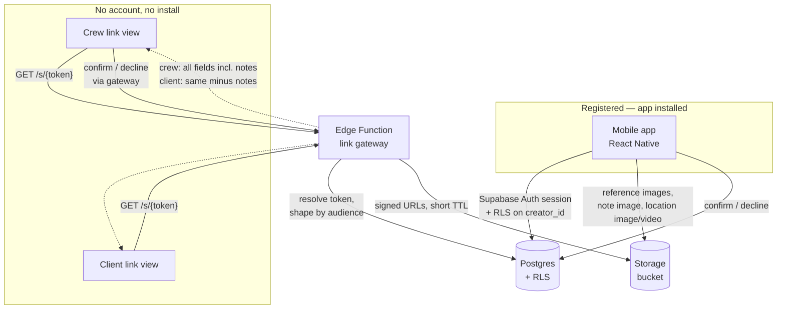

# Architecture — Luna CRM v1

- **Subproject:** 001-luna-crm
- **Date:** 2026-08-25
- **Derived from:** `02-product/prd.md` (Constraints and dependencies), all 24 active stories
  under `02-product/epics/`, `03-design/flows.md`, `03-design/ux-notes.md`,
  `decisions/ADR-016-*.md` (UI layer; supersedes `ADR-010`)
- **Status:** accepted at the phase-04 gate, 2026-08-25 — the choices here are `ADR-011` to `ADR-014`

## What shapes this
Two constraints from the PRD decide the whole shape, and neither is negotiable:

1. **"iOS app plus web/browser access, so people without the app installed can still use a
   link"** (`prd.md`, Constraints; `00-intake/s01-2026-08-20/transcript.md`, lines 20–26).
   Two of the three flows (`flows.md` Flow 2, Flow 3) belong to people with **no account and
   no install**. That is not a nice-to-have — it is where crew and clients live.
2. **React Native, with React Native Reusables as the UI layer** (`decisions/ADR-016-*.md`,
   accepted 2026-08-26; supersedes `ADR-010`, which chose Tamagui). React Native itself is
   settled and built on. The UI layer above it was replaced once, six screens into the build —
   nothing in this document depends on which kit it is.

## Components

| Component | What it is | Serves |
|---|---|---|
| **Mobile app** | React Native + React Native Reusables, Expo Router | Registered users: shoot creator (Flow 1), self-registered crew (`US-009`) |
| **Link web surface** | The same codebase exported to static web (React Native Web), served as plain URLs | Crew link view (Flow 2), client link view (Flow 3) — no account, no install |
| **Backend** | Supabase: Postgres, Auth, Storage, Edge Functions | Both surfaces |
| **Link gateway** | One Edge Function that takes a link token and returns an audience-shaped payload | The link web surface only |

The link gateway is the non-obvious piece, and `US-023`/`US-026` are why it exists. A crew
member viewing a peer sees **every** field including notes; a client viewing the same person
sees **the same fields minus notes**. Same row, two audiences, one column of difference. Handing
the table to the browser and hiding a field in the UI would ship the notes to the client and
rely on them not looking. So the token is resolved server-side and the payload is built per
audience — the client's response never contains a notes value at all. See
`decisions/ADR-013-*.md`.

## Data flow

Reads and writes from the app go straight to Postgres under an Auth session, with row-level
security keyed on `Shoot.creator_id` — a creator reaches only their own shoots. Everything
anonymous goes through the gateway instead: it is the only path that can read a shoot without a
session, and it is the only place the crew/client field split is enforced.

Media never streams through the gateway. Files sit in a private Storage bucket; the gateway
hands back short-lived signed URLs so the browser fetches directly from Storage.

## Third-party services — development vs production

Prices verified 2026-08-25 against the sources at the end of this file. The list of services is
much the same either way; **what changes is the tier**. Three stages, and the cost does not begin
at stage 1.

### Stage 1 — Development (12–16 weeks): $0/month
Nothing here needs paying for.

| Service | Tier while building | Why it is free here |
|---|---|---|
| Supabase | **Free** | 2 projects allowed (dev + prod). Inactivity pauses are irrelevant while someone works in it daily |
| Cloudflare Pages | **Free** | 500 builds/mo, unlimited bandwidth — commercial use permitted even later |
| Expo EAS | **not needed** | simulator + Metro covers most stories; `npx expo run:ios` builds locally with Xcode |
| Apple Developer Program | **not needed** | free provisioning runs the app on the developer's own iPhone (7-day signing expiry) |
| Domain | **not needed** | link views are reachable on the `*.pages.dev` subdomain |

Two conditions while on Supabase Free: keep the schema as **migration files in git** — Free has
zero backup retention, and there are reported cases of data loss when restoring a paused project;
and watch the **1 GB storage cap**, which spike S-4's video uploads can fill on their own.

### Stage 2 — Putting a build on Ilona's phone: $8.25/month
One service joins, and only because of who holds the device.

| Service | Tier | Trigger |
|---|---|---|
| Apple Developer Program | **$99/year = $8.25/mo** | TestFlight — required to put a build on someone else's phone. The app is delisted if the membership lapses |

Note for spike S-1 ("real screens on a device, shown to Ilona"): shown **in person on the
developer's own device, that spike still costs $0**. Only remote delivery needs the $99.
**This is what happened** — S-1 completed 2026-08-26 on a free-provisioned local build, so the
$99 was not spent and the Stage 2 trigger has still not fired.

### Stage 3 — Production, from the first real shoot: $34.35/month
The trigger is **the first real crew link sent to a real person** — when Ilona runs an actual
shoot on it. That arrives *before* App Store launch, not after.

| Service | Tier | Cost | Scales with |
|---|---|---|---|
| Supabase | **Pro** | **$25/mo** (incl. $10 compute credit, 100 GB storage, 250 GB egress) | storage above 100 GB at $0.021/GB; egress above 250 GB at $0.09/GB |
| Apple Developer Program | paid | **$8.25/mo** | flat |
| Domain | registered | **~$12–15/year ≈ $1.10/mo** | flat |
| Cloudflare Pages | Free | **$0** | builds, not traffic — so link-open volume never raises this |
| Expo EAS | Free, **optional** | **$0** | 15 iOS + 15 Android builds/mo |
| Google Play | one-time, **only if Android is in** | $25 once | see `open-questions.md` #1 |
| **Total floor** | | **$34.35/mo** | |

**Supabase must move to Pro at this stage — Free is disqualifying, not merely limited.** Free
projects pause after ~1 week of inactivity, so a crew member opening their link three weeks after
it was sent hits a paused project instead of a call sheet: precisely the moment the product exists
to serve.

**Expo EAS is a convenience, not a dependency, at any stage.** The build machine is a Mac, so
Xcode does everything EAS does — including TestFlight uploads and App Store submission. EAS is
listed at $0 because its free tier removes certificate handling for nothing, and because EAS
Update can push JS-only fixes to installed apps without App Store review — worth having once real
shoots depend on it. Drop it without consequence.

**Vercel is ruled out for the link surface.** Its Hobby tier forbids commercial use, so a paid
product on it is in violation from the first subscriber; Pro is $20/mo. Cloudflare Pages permits
commercial use at $0 — a $20/mo difference for identical function. See `decisions/ADR-012-*.md`.

### Against the PRD's price point
`prd.md` fixes the price at **$5/month**. The stage-3 floor of $34.35/mo is covered by **7 paying
subscribers**. Per-user variable cost past that is roughly $0.20/month at 10 shoots/user/month —
an *assumption*, derived in `risks.md` R-4, not a measured figure.

So the price point clears infrastructure easily, and nothing is owed during the months when the
work actually happens. What the $5 does not price at all is the build itself — see `risks.md`,
top item.

## Sources
- Supabase pricing and free-tier pause: [UI Bakery](https://uibakery.io/blog/supabase-pricing), [Flexprice](https://flexprice.io/blog/supabase-pricing-breakdown), [Jetadmin](https://www.jetadmin.io/blog/supabase-pricing-2026-guide-to-plans-limits-and-real-world-costs/)
- Apple Developer Program fee: [Appaloosa](https://www.appaloosa.io/blog/what-is-the-apple-development-program), [Magora](https://magora-systems.com/apple-developer-fee/)
- Expo EAS tiers: [Expo docs — plans](https://docs.expo.dev/billing/plans/)
- Vercel Hobby commercial-use restriction vs Cloudflare Pages: [The Search Sherpa](https://thesearchsherpa.com/is-vercel-free-for-small-business/), [Prompts to Product](https://www.promptstoproduct.com/vercel-free-tier-limits)

## File hosting — *added 2026-10-03, `ADR-020`*
Raw files and finished photos do **not** go to Supabase Storage: its $0.09/GB egress is the
reason. They go to a private Backblaze B2 bucket (EU Central), through B2's S3-compatible API and
behind a small storage interface so the provider can later become Cloudflare R2.

- **Upload:** the app — in a desktop browser since `ADR-021` — asks an Edge Function for a presigned upload URL — which first checks the
  account's 200 GB quota (`US-036` AC-3) — and uploads straight to B2. Files of tens of GB need
  multipart upload.
- **Read:** the link gateway (`ADR-013`) adds presigned B2 URLs to the **client** payload only.
- **Delete:** a daily `pg_cron` job calls an Edge Function that deletes the objects and rows of
  every shoot past `files_delete_at`, and sends the 3-day push warnings (`US-037`, `US-039`).
- **Push:** new — APNs through Expo push notifications; device tokens stored per user.

## The photographer's app on the web — *added 2026-10-04, `ADR-021`*
The creator's routes, already part of `expo export -p web`, are now a supported surface: the whole
photographer's app in any modern desktop browser, served by Cloudflare Pages beside the link
views. File uploads start here (`US-036`): the browser slices each file (`File.slice`) and `PUT`s
the parts to presigned B2 multipart URLs — the same Edge Function as in the section above. The
iOS app does not upload files for now.
